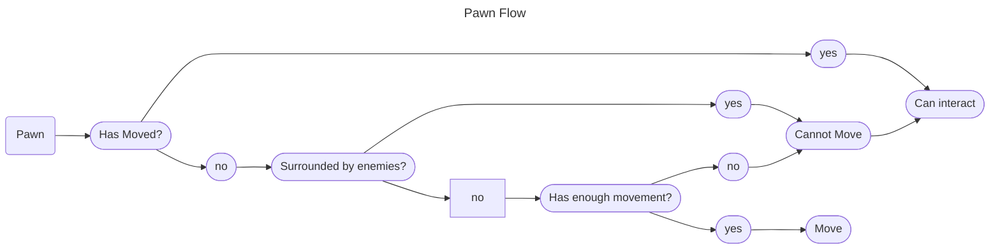

```mermaid
---
title: Pawn Flow
---
flowchart LR;
  pawn(Pawn) --> hasMoved([Has Moved?])
  
  hasMoved --> notMovedYet([no])
  notMovedYet --> isTrapped
  hasMoved --> yesMoved([yes])
  yesMoved --> canInteract

  isTrapped([Surrounded by enemies?])
  isTrapped --> yes([yes])
  yes --> cannotMove([Cannot Move])

  isTrapped --> no 
  no --> hasMovement([Has enough movement?])
  hasMovement --> yesEnough([yes])
  hasMovement --> noNotEnough([no])
  yesEnough --> move([Move])

  noNotEnough --> cannotMove([Cannot Move])
  cannotMove --> canInteract([Can interact])
  
```
