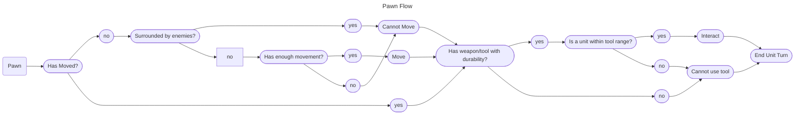

```mermaid
---
title: Pawn Flow
---
flowchart LR;
  pawn(Pawn) --> hasMoved([Has Moved?])
  
  hasMoved --> notMovedYet([no])
  notMovedYet --> isTrapped
  hasMoved --> yesMoved([yes])
  yesMoved --> canInteract

  isTrapped([Surrounded by enemies?])
  isTrapped --> yes([yes])
  yes --> cannotMove([Cannot Move])

  isTrapped --> no 
  no --> hasMovement([Has enough movement?])
  hasMovement --> yesEnough([yes])
  hasMovement --> noNotEnough([no])
  yesEnough --> move([Move])
  move --> canInteract 

  noNotEnough --> cannotMove([Cannot Move])
  cannotMove --> canInteract([Has weapon/tool with durability?])
  canInteract --> yesInteract([yes])
  canInteract --> noInteract([no])
  yesInteract --> unitInRange([Is a unit within tool range?])
  unitInRange --> yesInRange([yes])
  unitInRange --> noInRange([no])
  yesInRange --> interact([Interact])
  interact --> endTurn

  noInteract --> noUseTool([Cannot use tool])
  noInRange --> noUseTool
  noUseTool --> endTurn

  endTurn([End Unit Turn])
  
```
